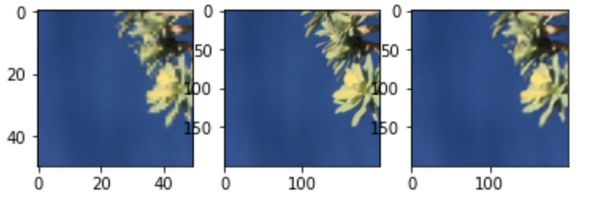

# ESRGAN

This directory contains the jupyter notebooks that I have used to implement ESRGAN. The model uses a relativistic discriminator, an RRDB based generator and also incorporates perceptual loss. The main ideas have been taken from [this paper on ESRGAN](https://arxiv.org/abs/1809.00219).

## Results

Some of the results, which can also be found in the notebooks are given below.

### From the first notebook

### From the second notebook

### From the third notebook

